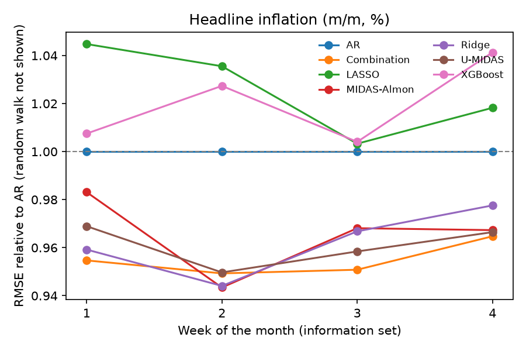
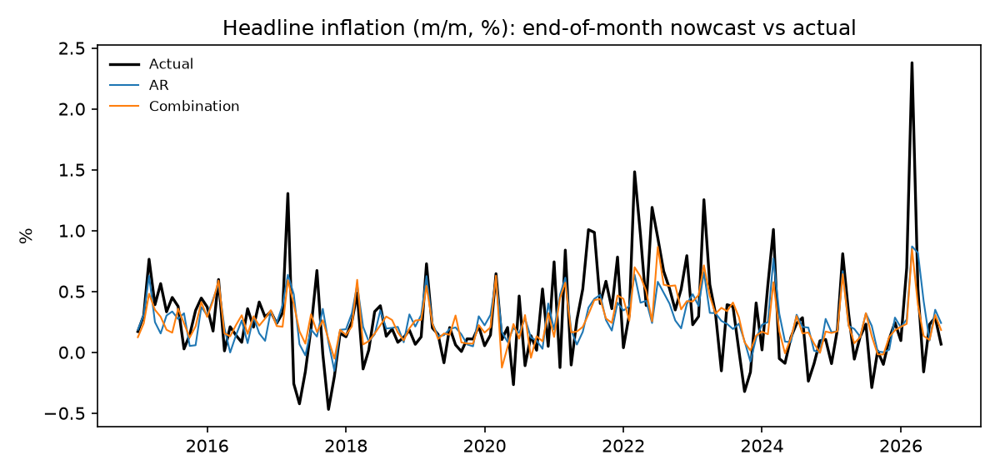

# Nowcasting Peruvian inflation with mixed-frequency and machine learning models

[](https://github.com/Rodgrandez/peru-inflation-nowcasting/actions/workflows/ci.yml)

How much does the estimate of the current month's inflation in Lima improve as daily data arrive during the
month, and which models use that information best? This project compares a random walk, an AR benchmark,
U-MIDAS and Almon-MIDAS regressions, Ridge, LASSO, XGBoost and a forecast combination, re-estimated every
month on an expanding window, for headline inflation and inflation excluding food and energy.

<!-- RESULTS:START -->
Out-of-sample nowcasts, expanding window, 2015-01 to 2026-08 (140 months). RMSE relative to an AR benchmark (below 1 = better than AR).

**Headline inflation**

| Model | Week 1 | Week 2 | Week 3 | Week 4 | DM p-value (week 4) |
|---|---|---|---|---|---|
| Combination | 0.955 | 0.949 | 0.951 | 0.965 | 0.098 |
| U-MIDAS | 0.969 | 0.950 | 0.958 | 0.966 | 0.256 |
| MIDAS-Almon | 0.983 | 0.943 | 0.968 | 0.967 | 0.283 |
| Ridge | 0.959 | 0.944 | 0.967 | 0.978 | 0.360 |
| AR | 1.000 | 1.000 | 1.000 | 1.000 | – |
| LASSO | 1.045 | 1.036 | 1.003 | 1.018 | 0.589 |
| XGBoost | 1.007 | 1.027 | 1.004 | 1.041 | 0.209 |
| RW | 1.523 | 1.523 | 1.523 | 1.523 | 0.000 |

Best end-of-month model: **Combination**, relative RMSE **0.965** (Diebold-Mariano p-value vs AR: 0.098).

**Inflation excluding food and energy**

| Model | Week 1 | Week 2 | Week 3 | Week 4 | DM p-value (week 4) |
|---|---|---|---|---|---|
| AR | 1.000 | 1.000 | 1.000 | 1.000 | – |
| MIDAS-Almon | 0.993 | 1.025 | 1.099 | 1.020 | 0.681 |
| Combination | 0.989 | 1.008 | 1.064 | 1.033 | 0.612 |
| U-MIDAS | 0.960 | 0.981 | 1.036 | 1.039 | 0.526 |
| Ridge | 0.993 | 1.006 | 1.099 | 1.072 | 0.237 |
| LASSO | 1.166 | 1.163 | 1.139 | 1.142 | 0.089 |
| XGBoost | 1.068 | 1.083 | 1.168 | 1.165 | 0.127 |
| RW | 2.065 | 2.065 | 2.065 | 2.065 | 0.000 |

Best end-of-month model: **AR**, relative RMSE **1.000** (Diebold-Mariano p-value vs AR: –).
<!-- RESULTS:END -->

 

## Data (public, BCRP statistics API)
- Targets: monthly CPI inflation for Metropolitan Lima (PN01271PM) and CPI excluding food and energy (PN01276PM).
- Monthly: 12-month-ahead inflation expectations survey (PD12912AM), used with a one-month lag.
- Daily: interbank exchange rate (PD04638PD), interbank interest rate (PD04692MD), WTI oil (PD04705XD),
  wheat (PD31887XD), maize (PD31888XD) and soybean oil (PD31889XD).

## Design
- Information sets at the end of weeks 1-4 (days 7, 14, 21 and month end). Inflation and expectations for the
  current month are never used: they are published after the month ends.
- Daily prices: non-positive values and isolated glitches in the published series (e.g. wheat at 0.46 US$/t on
  2005-03-17) are dropped using only past observations (more than 0.4 log points from the trailing 10-day median).
- Estimation starts in 2003-01 (inflation-targeting regime); nowcasts are evaluated from 2015-01.
- Diebold-Mariano tests on squared errors with the Harvey-Leybourne-Newbold correction.

## Reproduce
```bash
conda env create -f environment.yml && conda activate inflation-nowcast
make all        # or: python -m nowcast.pipeline all
```

License: MIT.
